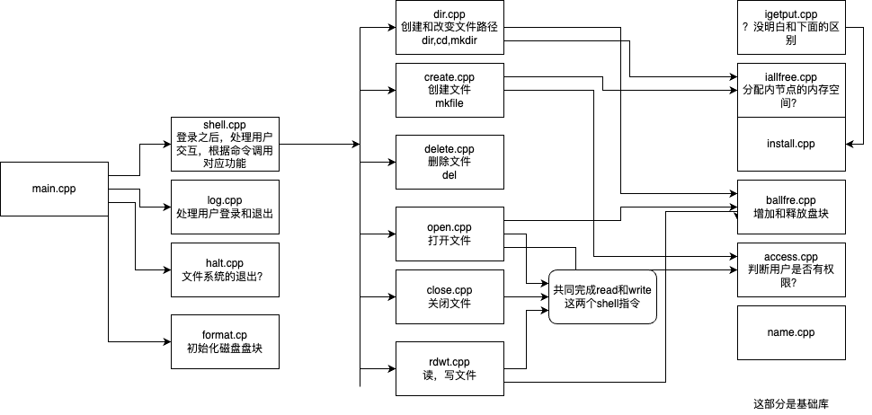

# OS_file
23秋小组作业-文件管理

# 要求

## 画出模块关系图

平平无奇的画图任务～【🏗️施工中】




## 修改错误

- 创建一个与目录同名的文件时，系统崩溃 @scatyf3
- 重复创建文件目录时提示错误；重复创建同一个文件时出错 @scatyf3
- Dir命令，显示当前目录一直是“..”，请修改为正确的当前路径  <-@scatyf3
- 在根目录下面创建子目录a，在a中创建文件b，并写入大于一个块(512字节)的内容，之后返回根目录，查看目录内容的时候会出现错误 
  - somwhow不存在错误了
- Read或Write一个不存在的文件时，程序会崩溃
  - somehow不错误了
- 磁盘回收后再分配会出错，例如图中的第13个盘块就不见了
- 其他错误

## 增加新的功能

- 现有的程序是用内存模拟磁盘，建议大家改用文件模拟磁盘。这样，新创建的文件和目录等可以保留在模拟磁盘中，下次重新登录系统，可以查看上次登录时创建的文件和目录；
  - 根据我的理解，我们需要增加halt.cpp和format.cpp的功能，然后把内存里的节点持久化保存到外存上 ✅
    - 现在可以做到把数据打包保存到data/data.bin，但是读取的时候，仍然只能读出默认的开始状态
  - 另外，所有新建的文件，都不涉及到对filsys超级块的更改，是这里导致了上述的错误吗
- 增加新建用户的新功能：在命令行中输入“adduser ***”后，可以新增用户，新增的用户下次登录后仍然存在；
- 增加password命令可以修改用户密码；
- 增加查看当前用户信息的新功能：在命令行中输入“who”，可以显示当前用户的所有信息，包括这个用户的id号、登录密码、所属用户组等；
- 在命令提示符前加入路径；增加pwd命令用来显示当前路径；
- 文件名更名；
- 复制文件；
- 其他功能。

# 项目结构

```sh
.
├── LICENSE //证书
├── README.md //描述文档
├── build //构建规则
│   ├── CMakeCache.txt
│   ├── CMakeFiles
│   ├── CMakeLists.txt //跨平台构建规则
│   ├── Makefile
│   ├── cmake_install.cmake
│   └── filsys
├── doc //教师派发的文档
│   ├── 文件系统实验要求.docx
│   ├── 文件系统实验资料.pdf
│   └── 文件系统实验的建议.docx
├── src //源代码
│   ├── Makefile
│   ├── access.cpp
│   ├── ballfre.cpp
│   ├── close.cpp
│   ├── creat.cpp
│   ├── delete.cpp
│   ├── dir.cpp
│   ├── filesys.h
│   ├── format.cpp
│   ├── halt.cpp
│   ├── iallfre.cpp
│   ├── igetput.cpp
│   ├── install.cpp
│   ├── log.cpp
│   ├── main.cpp
│   ├── name.cpp
│   ├── open.cpp
│   ├── rdwt.cpp
│   └── shell.cpp
└── test //测试

```

## build

```sh
cd build
cmake .
make
```

# 程序功能解析

```cpp
char commands[CNUM][CLEN]={
"exit",
"dir",
"mkdir",
"cd",
"mkfile",
"del",
"write",
"read"
};
```

